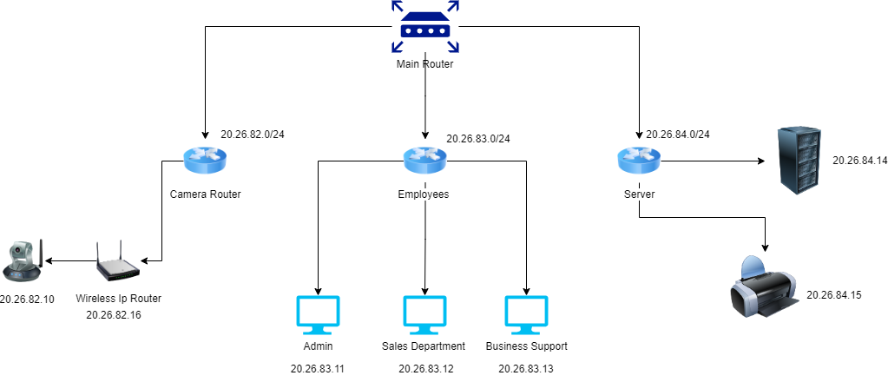

   Device          IP Address 
Camera Router 	  20.26.82.0/24
Employees	     20.26.83.0/24
Server           20.26.84.0/24

Serving as the company's central location, the main office is connected to the internet via a network's gatekeeper along with port. Ethernet lines link the upmarket facility and the shop premises. Each segment has its own VLAN; these include partnered fitness centers, businesses, stores, and studios. There are now WiFi connection points available for both customer and employee use. Administering an arrangement is known as retail. 
2. Important Architectural Choices Described in detail:
Separating a network's traffic enhances management, silence, and storage space by separating communications into VLANs. Robust security measures, such as networks and systems that prevent attacks, preserve communications. Connecting with a membership system of databases enables customised products and streamlines procedures. 
Using cloud assets ensures efficiency, quick expansion, flexibility, and regulatory compliance. 
WiFi configuration: WPA2-PSK to protect employees and WPA2-Enterprise with consumers; SSIDs are "GymNetwork" for staff and "MemberNetwork" with users. Regarding the ability to connect of those involved, AES-encrypted techniques, non-overlapping approaches, and seamless travelling are offered.

Router:
Cisco ISR 4000 Series, delivering high performance and security options that work well for an average sized network, and can also handle a large one. Rates form AUD $2,500 basic.

Access Points:
Resilient Cisco Catalyst 9100 series switches to create optimized wifi in various types of environments. Unit expenses comprise between AUD $500 to $1000 per unit.

Switches:
Cisco offers the Catalyst 9000 series under the range that carries advanced management capabilities. The cost for the switch starts at the minimum of AUD $1000 per switch.

